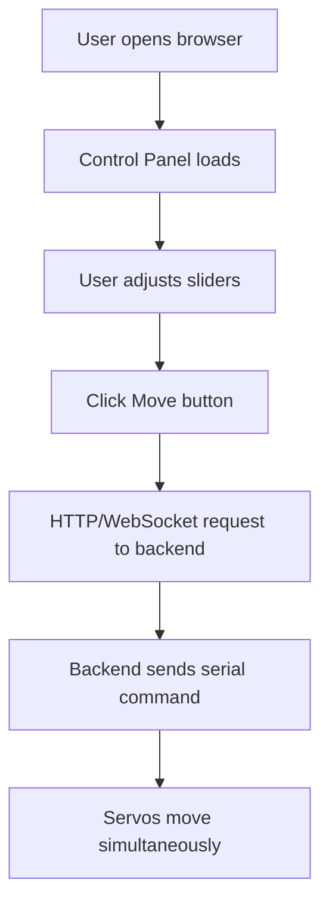

## 1. Product Overview
A web-based GUI application for controlling three servo motors (IDs 22, 23, 24) via a web browser. Users can set target positions for each servo and trigger simultaneous movements.

## 2. Core Features

### 2.1 User Roles
| Role | Registration Method | Core Permissions |
|------|---------------------|------------------|
| User | No registration required | Control servo motors |

### 2.2 Feature Module
1. **Control Panel**: Servo position controls, sync movement button, preset positions
2. **Status Monitor**: Real-time position feedback, connection status

### 2.3 Page Details
| Page Name | Module Name | Feature description |
|-----------|-------------|---------------------|
| Control Panel | Servo Controls | Individual sliders for servo positions (0-4095), speed/acceleration settings |
| Control Panel | Sync Movement | Button to trigger simultaneous movement of all servos |
| Control Panel | Presets | Quick preset buttons for common position configurations |
| Status Monitor | Connection Status | Shows serial port connection status |
| Status Monitor | Position Feedback | Displays current positions of each servo |

## 3. Core Process
1. User opens the web browser and navigates to the control panel
2. User adjusts position sliders for each servo (22, 23, 24)
3. User clicks "Move" button to send positions to servos
4. Backend server receives position data and sends commands to servos via serial port
5. Servos move to target positions simultaneously

## 4. User Interface Design

### 4.1 Design Style
- Primary color: Deep blue (#1e40af) for tech/industrial feel
- Secondary color: Cyan (#06b6d4) for accent elements
- Button style: Rounded corners, gradient backgrounds
- Font: JetBrains Mono (monospace) for technical feel
- Layout: Card-based with dark theme for industrial aesthetic
- Animation: Smooth slider transitions, button hover effects

### 4.2 Page Design Overview
| Page Name | Module Name | UI Elements |
|-----------|-------------|-------------|
| Control Panel | Header | Title, connection status indicator |
| Control Panel | Servo Cards | Three cards, each with ID label, position slider, current value display |
| Control Panel | Settings | Speed and acceleration input fields |
| Control Panel | Actions | Move button, preset buttons |
| Status Monitor | Feedback | Real-time position readout for each servo |

### 4.3 Responsiveness
- Desktop-first design
- Mobile-adaptive with stacked layout on small screens
- Touch-optimized sliders for mobile devices
