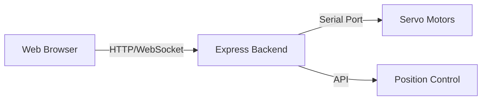
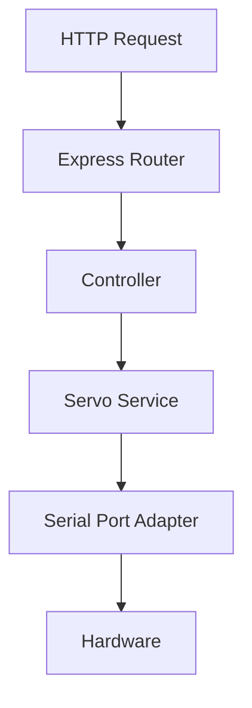

## 1. Architecture Design


## 2. Technology Description
- Frontend: React@18 + tailwindcss@3 + vite
- Initialization Tool: vite-init
- Backend: Express@4 + Node.js
- Serial Communication: SerialPort library
- Build Tool: Vite

## 3. Route Definitions
| Route | Purpose |
|-------|---------|
| / | Main control panel page |
| /api/move | POST endpoint to send position commands to servos |
| /api/status | GET endpoint to get servo status |

## 4. API Definitions

### 4.1 POST /api/move
**Request Body:**
```typescript
{
  positions: {
    22: number;  // 0-4095
    23: number;  // 0-4095
    24: number;  // 0-4095
  };
  speed?: number;     // 0-2400, default 2400
  acceleration?: number; // 0-254, default 50
}
```

**Response:**
```typescript
{
  success: boolean;
  message: string;
}
```

### 4.2 GET /api/status
**Response:**
```typescript
{
  connected: boolean;
  positions?: {
    22: number;
    23: number;
    24: number;
  };
}
```

## 5. Server Architecture Diagram


## 6. Data Model
No persistent database required. All data is transient and communicated via API.

## 7. Project Structure
```
web-servo-control/
├── src/
│   ├── components/
│   │   ├── ServoControl.tsx
│   │   ├── ControlPanel.tsx
│   │   └── StatusBar.tsx
│   ├── pages/
│   │   └── Home.tsx
│   ├── hooks/
│   │   └── useServoControl.ts
│   ├── utils/
│   │   └── api.ts
│   ├── App.tsx
│   └── main.tsx
├── api/
│   ├── server.ts
│   ├── routes/
│   │   └── servo.ts
│   └── services/
│       └── servo.ts
├── index.html
├── package.json
├── vite.config.ts
└── tailwind.config.js
```
